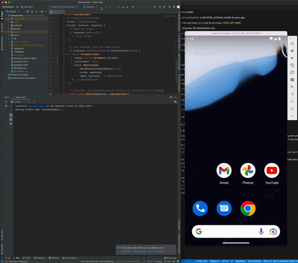

# What we'll do

This repo is a modified version of the demo flutter application on github [fireship-io/flutter-firebase-quizapp-course](https://github.com/fireship-io/flutter-firebase-quizapp-course).

I created this readme to walk you through what you need to get this Android app running locally, so you can start learning how to develop with Flutter but editing the project directly, and seeing the changes I made to get it working at the various stages.

Commits:
- `73e8e3cfdbfa3fac979ff151ee8304c455714cce` Initial App
- `67450d61858022e0bedf3307e08a3f5d75fe10ee` Part 1 changes - Simple app name changes, app almost identical
- `27c4d14574a7e1693b1a38178c0bbd4c1819504d` Part 2 changes - Removing and changing the more complex parts of the app so it's just basic text screens and auth
- `3056f2df73b0e99f841b3ab457478516c54fc7eb` Part 3 changes - Tidy up and Release notes

**Flutter Firebase - The Full Course 3.0**

🕊️🔥 Build a realtime Quiz App from scratch with Flutter 3 & Firebase.

**Learn it**

Enroll in the [Flutter Firebase Course](https://fireship.io/courses/flutter-firebase/) on Fireship.

**Learning Goals**

- 👨‍🎤 Build a complete Flutter app with Firebase
- 🐦 Master most common Flutter widgets
- 🔏 User Authentication (Apple, Google, Anonymous)
- ⚒️ State Management with Provider
- 🔥 Model relational Firestore data
- 🎭 Animation for realtime data streams
- ⚓ Organize large Flutter projects
- 🤖 Firestore -> Dart Classes with JSON Serializable
- 🚀 Deploy to the Apple App Store and Google Play

# Expectations

All instructions in this README have been tested on a mac (m1), but Google has instructions for other systems.

Because Flutter development and testing require emulators, and have such deep integration into your native workstation, nothing has been containerized, all steps run on the workstation.

It's possible to use VSCode for Flutter development, but this guide focuses on Android Studio (as it's needed for Android emulators anyway).

# Workstaion Setup

On your workstation will need:
- Flutter (which also takes care of the Dart requriement)
- Java (for build tasks used by your project)
- An IDE (Android Studio) with Flutter plugin (Android Studio includes SDK Manager, which takes care of Android Emulator requirement)

```
# install flutter
brew install --cask flutter

# for things like gradle builds (which are tied to your workstations' version of flutter)
brew install java
export JAVA_HOME=/opt/homebrew/opt/openjdk/

# remember to manually add flutter plugin for android-sudio once installed, 
brew install --cask android-studio
```

# Android Studio Project Setup

First, git clone this repo, and then run `flutter clean` in a terminal. This will ensure any of the previous project-specific files won't cause an issue (this repo contains `.flutter-plugins-dependencies` which you do not want interfering with your new project).

Now you can launch Android Sudio and go to "File > Open". Select this folder.

You should be able to configure a new Android device (eg Pixel 3 XL) using the Device Manager.

You should be able to click "Run main.dart". This will:
- Run `flutter pub get`
- Build the app
- Start the emulator/device and connect to it, and load the app

15 seconds:


## Troubeshooting

If you have trouble loading the devcies in a new Android Studio project, open "main.dart > Edit Configuration" and check for the error "Error: Dart SDK is not configured". You may need to go to "Preferences > Languages & Frameworks > Dart" and "Enable Dart support for this project" as well as enter the SDK Path, eg `/opt/homebrew/Caskroom/flutter/3.0.5/flutter/bin/cache/dart-sdk` and "Enable Dart support for the modules".

Do not try and open more than one project at a time, you may have build/run issues and problems connecting to the emulator.

If you get a storage related error you may need to give the device more storage space:

```
adb: failed to install /app.apk: Failure [INSTALL_FAILED_INSUFFICIENT_STORAGE]
```

Things to try:
- Devices seem to default to `800 mb` and I typically change them to something large like `6144 MB` (6 GB) - See [Create and manage virtual devices](https://developer.android.com/studio/run/managing-avds)
- You can also `wipe data` on emulators
- `flutter clean` and restart emulators/android studio

# Next steps

You're now ready for Flutter app development!

## Making the app your own - Part 1

We have 2 values to create for our new project.
- YOUR_APP_NAME, eg `thenetworkapp`
- REVERSE_DOMAIN_NAME, eg `io.thenetwork.thenetworkapp`

The first change we'll make to the app will be to change references from quizapp to YOUR_APP_NAME.

In `pubspec.yaml` change `name:` to YOUR_APP_NAME.

In `android/app/build.gradle` change `applicationId:` to REVERSE_DOMAIN_NAME for your app.

In `lib/` replace refernces to local packages from `package:quizapp` to `package:YOUR_APP_NAME`

Delete `ios/` folder if you're not planning on doing any iOS development yet.

You can add a `android/app/google-services.json` now if you've configured your Firebase App, or later when you're ready.

Your app should still load, however it may not be able to connect to the Firebase backend to load topics.

## Android Play store and Firebase Setup (small detour to make sure you get the basics setup)

We'll need to deploy a real app soon and that will require:
- A developer account in the play store
- A firebase account

### Firebase setup (needed to test auth locally)

Login to https://console.firebase.google.com/ with a Google Acocunt.

Create a new Android App, using these details:
- REVERSE_DOMAIN_NAME, eg `io.thenetwork.thenetworkapp`
- In a terminal, run `./gradlew signingReport` from your project folder and get the SHA-1 from the `debugAndroidTest` section.

You should now have a `google-services.json` file that you can put in `android/app/` so your app can connect to Firebase.

You should enable auth services like `anonymous` and `google`, otherwise they won't work when you load your app.
### Play store setup (needed to deploy an app)

Follow a guide like this: [How to Publish an Android App on Google Play Store: A Step-by-Step Guide](https://orangesoft.co/blog/how-to-publish-an-android-app-on-google-play-store)
- Signup for a [google play developer account](https://play.google.com/apps/publish/signup/)
  - use a real google account
  - prepare to validate with a photo of your id
  - $25

- You can start creating your store listing, but you will need photos of your app and other things, you can come back to the details later

## Making the app your own - Part 2

We're going to simplify the application by removing some of the quiz specific parts. This will make it easier to deploy a real app, while still keeping the core parts of login and auth. It will also give us a chance to become familar with a real app structure when it come to building something more complicated in the future.

- `lib/about/about.dart` - Update the text to explain what this app does
- In `home/home.dart` replace `topics` to `entry` and `EntryScreen`
- Rename `topics/` to `entry/` and `topics.dart` to `entry.dart` (convert to a simple text page like the about page), and delete `topic_item.dart`, `drawer.dart`
- Update `entry.dart` so that it's just the scafold, with some text in the body, with links to profile and bottom nav (but remove all the topic load and drawer referenecs) ... make sure you update it to say `EntryScreen`
- Update `routes.dart` and `home.dart` to `EntryScreen`
- Update `profile` to remove reference to quizzes
- Remove `quiz/`
- Update `bottom_nav.dart` with custom text/icon for your home/entry
- `firestore.dart` and `models.dart` remove most things here
- remove everything under `JsonSerializableGenerator` in `models.g.dart` 
- `progress_bar.dart` remove `TopicProgress` class
- `main.dart` to keep the code/flow but avoid having to worry too much about firebase structures, use a dummy stream

38 seconds:



## Release process and tidy up - Part 3

First let's take care of a bit of tidy up activities to get our project in a healthly state.

### Tidy up

#### Source file cleanup

One app-name specific area we need to fix is `app/src/main/kotlin/com/example` - replace quiz reference in the folder, and `Mainactivty.kt`, this may have caused the following error:

```
E/AndroidRuntime(11978): FATAL EXCEPTION: main
E/AndroidRuntime(11978): Process: io.thenetwork.thenetworkapp, PID: 11978
E/AndroidRuntime(11978): java.lang.RuntimeException: Unable to instantiate activity ComponentInfo{io.thenetwork.thenetworkapp/io.thenetwork.thenetworkapp.MainActivity}: java.lang.ClassNotFoundException: Didn't find class "io.thenetwork.thenetworkapp.MainActivity" ...
```

Though it's not clear why this error didn't present itself earlier.

#### Project SDK Default

In Android studio, go to `File > Project Structure > Project SDK` and set it to the `Anroid API v33` from the drop down.

#### Local testing - with a real Android device

Settings > About > Tap x7
Settings > Developer Options > USB Debugging

Then connect via USB Cable and it should be a device you can connect to.


#### Update Gradle

You might have noticed these warnings when building:

```
Warning: Mapping new ns http://schemas.android.com/repository/android/common/02 to old ns http://schemas.android.com/repository/android/common/01
Warning: Mapping new ns http://schemas.android.com/repository/android/generic/02 to old ns http://schemas.android.com/repository/android/generic/01
Warning: Mapping new ns http://schemas.android.com/sdk/android/repo/addon2/02 to old ns http://schemas.android.com/sdk/android/repo/addon2/01
Warning: Mapping new ns http://schemas.android.com/sdk/android/repo/addon2/03 to old ns http://schemas.android.com/sdk/android/repo/addon2/01
Warning: Mapping new ns http://schemas.android.com/sdk/android/repo/repository2/02 to old ns http://schemas.android.com/sdk/android/repo/repository2/01
Warning: Mapping new ns http://schemas.android.com/sdk/android/repo/repository2/03 to old ns http://schemas.android.com/sdk/android/repo/repository2/01
Warning: Mapping new ns http://schemas.android.com/sdk/android/repo/sys-img2/03 to old ns http://schemas.android.com/sdk/android/repo/sys-img2/01
Warning: Mapping new ns http://schemas.android.com/sdk/android/repo/sys-img2/02 to old ns http://schemas.android.com/sdk/android/repo/sys-img2/01

Warning: unexpected element (uri:"", local:"base-extension"). Expected elements are <{}codename>,<{}layoutlib>,<{}api-level>
```

You should be able to address these by updating `android/build.gradle`:

```
// https://kotlinlang.org/docs/gradle.html
ext.kotlin_version = '1.7.10'

// https://mvnrepository.com/artifact/com.android.tools.build/gradle?repo=google
classpath 'com.android.tools.build:gradle:7.2.1'
```


And updating `android/gradle/warpper/gradle-wrapper.properties`:

```
# https://services.gradle.org/distributions/
distributionUrl=https\://services.gradle.org/distributions/gradle-7.3.3-all.zip
```

### First-time Deployment

For our release, We're going to follow the notes here: https://docs.flutter.dev/deployment/android and note down the changes we needed to make below.

To prepare for app realase, you may want to setup a privacy page, and consider getting a special email for communications about this app, and for things like admin/support for the app, like myappadmin@gmail.com
#### AndroidManifest

Make sure `android/app/src/main/AndroidManifest.xml` (and other variants like  `debug/` or `profile/`) has your correct app name.

#### Generate icons

Create an app icon `assets/icon/icon.png`

Use https://pub.dev/packages/flutter_launcher_icons to generate icons for the android platform.

Update `pubspec.yaml` with the flutter_launcher_icons dependency and config.

Run this:

```
flutter pub get
flutter pub run flutter_launcher_icons:main
```

Check the images that got created in `android/app/src/main/res/*/*`.

#### Create an upload keystore

```
keytool -genkey -v -keystore ~/upload-keystore.jks -keyalg RSA -keysize 2048 -validity 10000 -alias upload
```

Create a file `key.properties` but don't check this file in (it's part of gitignore so this shouldn't happen)

```
storePassword=YOUR_PASSWORD
keyPassword=YOUR_PASSWORD
keyAlias=upload
storeFile=/PATH/TO/upload-keystore.jks
```

Update `app/build.gradle` to use the key then run `flutter clean`.

#### Create a build for your release

Running flutter build defaults to a release build.

```
flutter build appbundle
```

The release bundle for your app is created at [project]/build/app/outputs/bundle/release/app.aab. Save it somewhere safe, a `flutter clean` will remove it.

You can now create a new release in the play store and upload your `app.aab` file (this could take a few hours, but likely for new accounts can take 1-10 days as it's a manual process).
#### Add Google's SHA-1 to Firebase

In Google Play Store Console go to `App integrity > App Signing > App signing key certificate > SHA-1`.

This is the public certificate for the app signing key that Google uses to sign each of your releases. Use it to register your key with API providers. The app signing key itself is not accessible, and is kept on a secure Google server.

Add this to Firebase (google signin will always work locally, but won't work in production without adding google's SHA-1).

#### Store listing

You will need an image `icon-512x512.png` to add to your store listing. I also saved mine in `assets/` for easy access.

You will also need screenshots from mobile (x2), 7" tablet, and 10" tablet.
